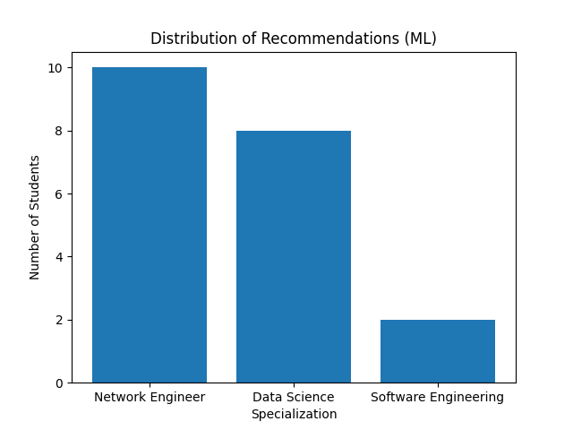

# 🎓 Student Specialization Recommendation System

## 🚀 Why This Project Matters

In many universities, students choose their specialization based on limited guidance. This project demonstrates how simple data-driven methods can support more objective and informed academic decisions.

By transforming student performance into structured data, institutions can reduce uncertainty and improve student outcomes.

## 📌 Overview
This project aims to recommend suitable specializations for students based on their academic performance. It compares a rule-based approach with a Manhattan Distance method to provide data-driven recommendations.

---

## 🎯 Objectives
- Help students choose the right specialization
- Compare rule-based vs distance-based methods
- Demonstrate data-driven decision making

---

## 🗂️ Dataset
This project uses a synthetic dataset representing student performance across several subjects:

- Math
- Programming
- Database
- Network
- GIS
- Systems
- GPA

---

## ⚙️ Methodology

### 🔹 Rule-Based Approach
Uses predefined thresholds:
- High Math + Programming → Data Science
- High Programming → Software Engineering
- High Network → Network Engineering
- Otherwise → General IT

---

### 🔹 Manhattan Distance Approach
Each specialization has an ideal profile. The system calculates distance:

d(x, y) = Σ |xᵢ - yᵢ|

The closest specialization is selected.

---

## 📊 Results

The visualization reveals a strong tendency toward Network Engineering recommendations, indicating that many students have performance profiles aligned with infrastructure and systems-oriented skills. In contrast, Data Science appears as a secondary path, suggesting moderate analytical strength among students. Software Engineering shows minimal selection, which may indicate either stricter thresholds or lower alignment with programming-heavy criteria in this dataset.
---

## 🔍 Insights
- Rule-based model may produce ambiguous results (General IT)
- Manhattan Distance provides more consistent recommendations
- Data can support better academic decision-making

---

## ⚠️ Limitations
- Synthetic dataset
- Manually defined profiles

---

## 🚀 Future Work
- Use real student data
- Add machine learning models
- Build interactive dashboard

- ## 🧠 Key Takeaways

- Data can support academic decision-making
- Distance-based methods provide more consistent recommendations than rule-based approaches
- Proper data structuring is essential for meaningful analysis

---

## 👤 Author
Abraham – Informatics Graduate, Universitas Papua
